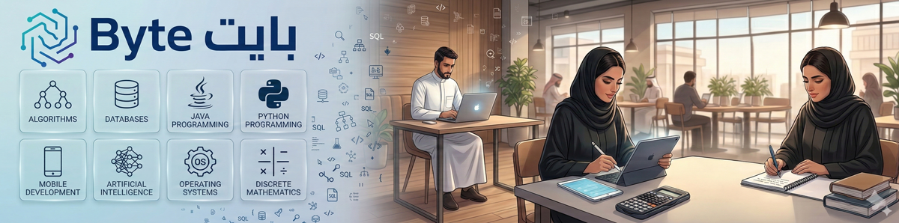

  

  <h1>💻 بايت (Byte)</h1>
  
<strong>بوابتك الذكية والأسرع للتفوق في كلية علوم الحاسب بالجامعة الإلكترونية (SEU)</strong>

  
  
  

---

## 🎯 ما هو مشروع "بايت"؟
لأن وقت طالب علوم الحاسب ثمين، وُلد مشروع **بايت (Byte)** ليكون الملاذ الآمن والكنز المعرفي لطلاب وطالبات كلية علوم الحاسب بالجامعة السعودية الإلكترونية. 

وداعاً للملازم الطويلة والتشتت بين المصادر! **بايت** عبارة عن منصة تفاعلية (حديقة رقمية) تُنسج بذكاء اصطناعي لتحيّل المقررات الجامعية المعقدة إلى صفحات بصرية (Glassmorphic) تفاعلية، تشرح المفاهيم بطريقة **(سريعة، كاملة، وعميقة)** لتضمن لك الفهم بلمح البصر والنجاح بأعلى الدرجات.

## ✨ المزايا المتفردة للمشروع

### 1- 🌗 ثنائية اللغة الفورية (Bilingual Toggle)
عكس الطرق التقليدية، يمكنك هنا التبديل فورياً بين الشرح الإنجليزي (حسب المنهج الأساسي) والترجمة العربية (لتبسيط الفهم العميق) بضغطة زر واحدة وبدون إعادة تحميل أي صفحة.

### 2- 🧠 مراجعة المفاهيم العميقة (Concept Vault)
لكل درس هناك "خزنة مفاهيم" تلخص أعقد الأفكار بطريقة (سؤال وجواب)، مع توجيه الضوء نحو الأخطاء الشائعة (Traps) التي تصطاد الطلاب في الاختبارات لتكون مستعداً لها تماماً.

### 3- ⚙️ خوارزميات تفاعلية (Interactive Algorithms)
هل استصعبت فهم خوارزميات البحث الترتيب يوماً؟ المنصة توفر مشغلات تفاعلية (Widgets) تتيح لك تشغيل الخوارزمية خطوة بخطوة وبالسرعة التي تلائمك لترى ميكانيكية عمل الأكواد بأم عينك.

### 4- 🃏 فلاش كاردز للمذاكرة (Flashcards)
نظام بطاقات استذكار تفاعلية مدمج في كل وحدة ليساعدك على الحفظ والتسميع المباشر للمصطلحات والمعادلات قبل الاختبارات.

### 5- 🎯 اختبارات ومراجعات شاملة (Mock Exams)
نظام "المحاكي" الفعّال! يوفر لك اختبارات منتصف الفصل (Midterm) والاختبارات النهائية (Final) بمعدل 70 سؤالاً تحاكي الاختبارات الحقيقية للكلية، وتمنحك تقييماً وتصحيحاً فورياً، مع توفير صفحات مُراجعة شاملة تسرد لك كل القوانين والنقاط الهامة.

### 6- 📹 فيديوهات منتقاة بعناية (Curated Videos)
يقوم محركنا الذكي بسحب أبرز وافضل مقاطع اليوتيوب (شروحات عربية وأجنبية) لتغطية المواضيع الأكثر تعقيداً في كل وحدة، لتجد الشرح المرئي جاهزاً في صفحة الدرس.

---

## 📅 خطة إضافة المقررات (Roadmap)
المشروع يغطي حالياً **مواد المستوى الخامس (Level 5)**، وسنتوسع تدريجياً لضمان شمولية جميع تخصصات علوم الحاسب بالكلية عبر خطة منهجية:
- [x] إطلاق مواد المستوى 5 (CS351, CS350, CS352, CS353).
- [ ] إضافة مواد المستوى 3 والمستوى 4 التأسيسية.
- [ ] إضافة مواد المستوى 6 المتقدمة.
- [ ] استكمال المستويين الأخيرين 7 و 8 حتى التخرج.
- [ ] إكمال بناء المنظومة بالكامل بكافة الدروس.

## 🤝 تواصل معنا
المشروع صُمم خصيصاً لأجلكم ولأجل تيسير دراستكم. إذا كان لديكم اقتراحات، ملاحظات، أو أفكار لتطوير المحتوى، يسعدني جداً تواصلكم المباشر عبر تيليجرام:

## 🚀 طريقة الاستخدام
الموقع لا يحتاج إلى سيرفر أو أي إعدادات معقدة. قم بتحميل الملفات وافتح ملف `index.html` في متصفحك أو قم بزيارة الرابط المباشر للمنصة. جميع الملفات التفاعلية تعمل بأعلى كفاءة مباشرة من جهازك.

  
<strong>صُنع بشغف لزملاء التخصص في SEU 🎓✨</strong>

