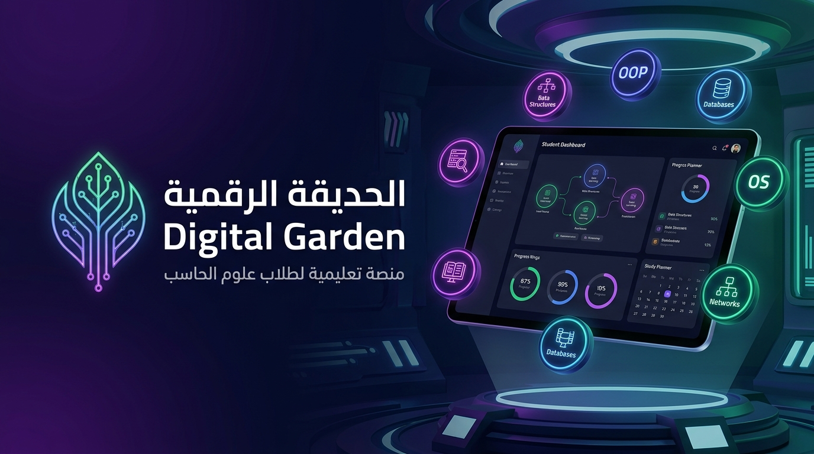

# الحديقة الرقمية | Digital Garden
> منصة تعليمية لطلاب علوم الحاسب بالجامعة السعودية الإلكترونية. محتوى من المقرر، مباشر، بدون حشو.

Digital Garden is a study platform for SEU computer science students. Course content that gets straight to the point — no filler, no fluff.

---

## المواد المتاحة بالمنصة

تغطي المنصة جميع مستويات التخصص الدراسي من المستوى الثالث وحتى التخرج، بالإضافة إلى المقررات العامة والأخرى الداعمة:

### المستوى الثالث (L3)
*   **CS230 — البرمجة كائنية التوجه (Object-Oriented Programming)**
*   **CS231 — تصميم المنطق الرقمي (Digital Logic Design)**

### المستوى الرابع (L4)
*   **CS240 — هياكل البيانات والخوارزميات (Data Structures and Algorithms)**
*   **CS241 — عمارة وتنظيم الحاسوب (Computer Architecture and Organization)**
*   **CS242 — نظرية الحوسبة (Theory of Computation)**
*   **CS243 — الرياضيات المتقطعة (Discrete Mathematics)**

### المستوى الخامس (L5)
*   **CS350 — قواعد البيانات (Database Systems)**
*   **CS351 — أنظمة التشغيل (Operating Systems)**
*   **CS352 — تحليل الأنظمة (Systems Analysis & Design)**
*   **CS353 — تصميم وتحليل الخوارزميات (Design & Analysis of Algorithms)**

### المستوى السادس (L6)
*   **CS360 — شبكات الحاسوب (Computer Networks)**
*   **CS361 — برمجة الويب (Web Programming)**
*   **CS362 — الذكاء الاصطناعي (Artificial Intelligence)**
*   **CS363 — مفاهيم لغات البرمجة (Concepts of Programming Languages)**
*   **CS364 — ريادة الأعمال في تقنية المعلومات (Entrepreneurship in IT)**

### المستوى السابع (L7)
*   **CS470 — تفاعل الإنسان والحاسوب (Human-Computer Interaction)**
*   **CS471 — أمن المعلومات (Information Security)**
*   **CS479 — مناهج البحث في تقنية المعلومات (Research Methods in IT)**
*   **CS475, CS476, CS477, CS478 — المواد الاختيارية من 1 إلى 4 (Electives 1-4)**

### المستوى الثامن (L8)
*   **CS480 — إدارة مشاريع تقنية المعلومات (IT Project Management)**
*   **CS481 — الأخلاقيات المهنية في تقنية المعلومات (Professional Ethics in IT)**
*   **CS489, CS499 — مشروع التخرج (Graduation Project)**

### مقررات أخرى داعمة (Others)
*   **الفيزياء:** SCI101 (فيزياء 1)، SCI201 (فيزياء 2)
*   **الرياضيات والإحصاء:** MATH150 (الرياضيات المتقطعة)، MATH251 (التفاضل والتكامل 2)، STAT101 (مبادئ الإحصاء)
*   **اللغات والإنشاء:** ENG103 (الإنشاء والتعبير)
*   **الثقافة الإسلامية:** ISLAM101، ISLAM102، ISLAM103، ISLAM104 (الثقافة الإسلامية 1 إلى 4)

---

## رحلة الطالب في الحديقة الرقمية: كيف تستفيد من المنصة؟

تم بناء **الحديقة الرقمية** لتكون رفيقك الأكاديمي المتكامل منذ أول يوم لك في تخصص علوم الحاسب وحتى التخرج. إليك كيف تبدأ وتستفيد من رحلتك التعليمية داخل المنصة:

1. **التهيئة والبداية الشخصية (Onboarding Setup):**
   بمجرد دخولك للموقع، يرافقك *معالج البداية التفاعلي* لضبط اسمك، وتحديد مستواك الحالي، وتعيين المعدل الأكاديمي الذي تطمح للوصول إليه، واختيار مقررات الفصل الحالي. يقوم هذا المعالج بتهيئة الموقع بالكامل ليصبح لوحتك التعليمية المخصصة.
   
2. **إدارة لوحة التحكم المخصصة (Unified Dashboard):**
   تظهر لك لوحة معلومات متكاملة تلخص حالتك الأكاديمية. يمكنك إعادة ترتيب الودجات بالسحب والإفلات وتخصيص طريقة العرض (عادي أو مضغوط) لرؤية المهام والملاحظات وجدول الأسبوع وتقدمك الدراسي في مكان واحد.

3. **المذاكرة الذكية بالتكرار المتباعد (Spaced Repetition):**
   عند دراسة أي وحدة من مواد التخصص، يمكنك استخدام *مخطط المذاكرة الذكي* الذي يستخدم **خوارزمية SM-2** لتحديد الفلاش كاردز والمفاهيم التي يجب مراجعتها اليوم. النظام يتوقع بدقة متى ستبدأ بنسيان المعلومة ليعرضها لك مجدداً في الوقت المثالي، مما يضمن ترسيخ المفهوم دون تكرار ممل.

4. **إدارة المهام والأجندة الدراسية (Task Tracker & Schedule):**
   يمكنك تسجيل مواعيد تسليم الواجبات، الكويزات، والمشاريع وتصنيفها. يتيح لك الفلتر الذكي معرفة المهام المتأخرة، أو مهام الأسبوع الحالي، مع إمكانية عرضها مجمعة لكل مادة. كما يتيح لك جدولك الأسبوعي تنظيم أوقات المحاضرات والأنشطة المختلفة.

5. **تخطيط وتوقع المعدل التراكمي للتخرج (GPA Forecaster):**
   الآن يمكنك تسجيل درجاتك وحساب معدلك التراكمي الفعلي بناءً على مقياس SEU 4.0. المميز هو *مستشرف المعدل* الذي يرسم لك منحنى بياني لسيناريوهات درجاتك في الفصول القادمة ليوضح لك الدرجات المطلوبة بالضبط في كل فصل للوصول إلى معدل التخرج المستهدف.

6. **البحث الشامل والملاحظات السريعة (Instant Search & Notes):**
   بضغطة واحدة (Ctrl + K) يمكنك البحث الفوري والعميق عن أي مفهوم، مصطلح، أو مادة باللغتين العربية والإنجليزية. كما يمكنك التقاط ملاحظات سريعة وتحديد تواريخ تذكير بها للرجوع إليها لاحقاً.

7. **حفظ ومزامنة تقدمك الأكاديمي (Zero-Config Cloud Sync):**
   لا تحتاج إلى كتابة بريد إلكتروني أو إنشاء حساب بكلمة مرور. ستحصل على **مفتاح مزامنة فريد (Sync Key)**؛ بمجرد نسخه ولصقه في أي جهاز آخر (هاتفك، جهازك اللوحي، كمبيوتر آخر)، سيتم مزامنة جميع مهامك، تقدمك الأكاديمي، جدولك وملاحظاتك في الخلفية وبسرعة فائقة.

---

## البنية التقنية

تعتمد الحديقة الرقمية على معالجة ذكية مؤتمتة تجمع بين الخفة والذكاء الاصطناعي:
- **الواجهة:** HTML5 + Vanilla JS + CSS3 مع أوضاع داكنة وثيمات مخصصة لكل مادة. تصميم متجاوب يدعم الهواتف والأجهزة اللوحية والحواسيب بالكامل، مع نظام تنقل سفلي للهواتف وثلاثة أوضاع مظهر (داكن، خافت، فاتح) مع تحكم كامل في حجم الخطوط.
- **المعالجة وسير العمل:** Python. بايبلاين مؤتمت يمتد من استخراج محتوى المقررات والكتب الدراسية (PDF) وتوليد شروحات الويب التفاعلية والرسوم التوضيحية وتوفير الفلاش كاردز والأسئلة.
- 
---

## مميزات المنصة الرئيسية

*   **خوارزمية جدولة المذاكرة SM-2:** نظام تكرار متباعد ذكي يجدول لك مراجعات الفلاش كاردز اليومية لمنع تراكم المحتوى الدراسي.
*   **لوحة تحكم تفاعلية وقابلة للتخصيص:** تحكم كامل بترتيب الودجات بالسحب والإفلات، وإمكانية تفعيل الوضع المضغوط أو إخفاء أقسام بأكملها.
*   **حساب واستشراف المعدل التراكمي:** أداة متطورة لحساب المعدل التراكمي وتوقعه ورسم مخططات مستقبلية لدرجاتك القادمة بناءً على نظام SEU 4.0.
*   **مزامنة سحابية هجينة بدون تسجيل:** مزامنة لحظية لتقدمك الدراسي ومهامك وملاحظاتك عبر الـ Cloud باستخدام مفتاح مزامنة فريد (Sync Key)، مع دعم كامل للعمل بدون اتصال (Offline) وتخزين احتياطي يدوي وتصدير/استيراد كملفات JSON.
*   **تصدير الإنجازات كـ PNG:** إمكانية تصدير بطاقة المعدل الأكاديمي وجدول المحاضرات كصور ملونة وجميلة مباشرة بضغطة زر لمشاركتها مع زملائك.
*   **إدارة المهام والمواعيد المتطورة:** تنظيم الواجبات والمشاريع والاختبارات وتصفيتها حسب الوقت (متأخرة، هذا الأسبوع، مكتملة) أو تجميعها حسب المادة.
*   **أجندة جدول الحصص الأسبوعي:** مساحتك لتوثيق أوقات المحاضرات والامتحانات بمرونة عالية داخل الأسبوع الدراسي.
*   **مدون ملاحظات وتذكيرات ذكي:** مساحة لكتابة أفكارك وملاحظاتك مع إمكانية أرشفتها وربطها بتواريخ تذكير مخصصة.
*   **محرك بحث شامل فوري (Ctrl+K):** فهرسة سريعة للبحث الفوري عن أي مفهوم أو مادة أو ملاحظة شخصية باللغتين الإنجليزية والعربية.
*   **تطبيق ويب تقدمي (PWA):** تثبيت المنصة على هاتفك أو حاسوبك الشخصي لتعمل كتطبيق أصلي خفيف وبسرعة عالية، حتى أثناء انقطاع الإنترنت.
*   **اختبارات تفاعلية فورية:** اختبارات قصيرة (MCQ وأسئلة مقالية) لكل وحدة دراسية مع تقييم وإجابات نموذجية فورية.
*   **تبديل ثنائي اللغة فوري (عربي / إنجليزي):** تبديل لغة الواجهة والمحتوى التعليمي بضغطة زر واحدة دون الحاجة لإعادة تحميل الصفحة.
*   **رسومات SVG تفاعلية:** رسوم بيانية وتوضيحية غنية بالمعلومات وتفاعلية بالكامل تشرح المفاهيم الرياضية والتقنية الصعبة بوضوح.

---

*الحديقة الرقمية © 2026 — SEU CS · [الموقع الفعلي](https://libbard.github.io/Garden) · [Telegram](https://t.me/Computing_and_Informatics)*
